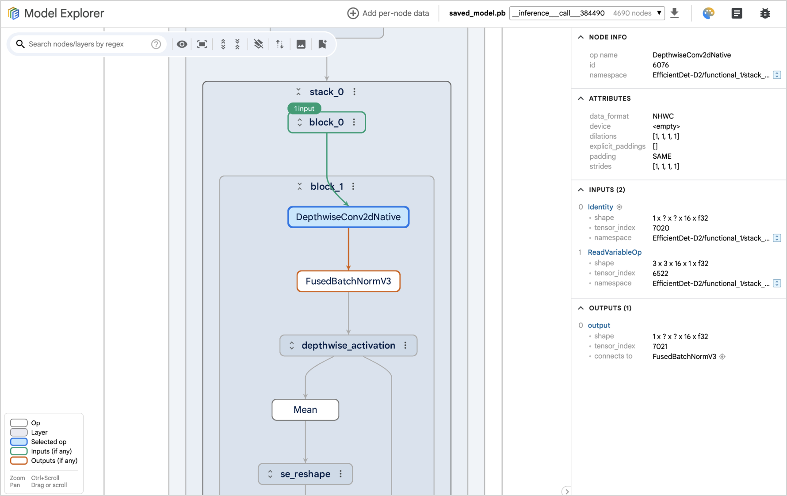

# Model Explorer [](https://badge.fury.io/py/ai-edge-model-explorer) [](https://badge.fury.io/js/ai-edge-model-explorer-visualizer)

Model Explorer offers an intuitive and hierarchical visualization of model
graphs. It organizes model operations into nested layers, enabling users to
dynamically expand or collapse these layers. It also provides a range of
features to facilitate model exploration and debugging, including the ability to
highlight input and output operations, overlay metadata on nodes, display layers
in interactive pop-ups, perform searches, show identical layers, GPU-accelerated
graph rendering, among others. It currently supports TFLite, TF, TFJS, MLIR, and
PyTorch (Exported Program) model format, and provides an extension framework for
developers to easily add support for additional formats.



<br>

To start using Model Explorer, run:

```shell
$ pip install ai-edge-model-explorer
$ model-explorer
```

Or give it a try on [Hugging Face](https://huggingface.co/spaces/google/model-explorer) (only support visualizing uploaded models)

Please check out our [Wiki](https://github.com/google-ai-edge/model-explorer/wiki) for
more details:

- [Installation](https://github.com/google-ai-edge/model-explorer/wiki/1.-Installation)
- [User Guide](https://github.com/google-ai-edge/model-explorer/wiki/2.-User-Guide)
- [Command Line Guide](https://github.com/google-ai-edge/model-explorer/wiki/3.-Command-Line-Guide)
- [API Guide](https://github.com/google-ai-edge/model-explorer/wiki/4.-API-Guide)
- [Run in Colab Notebook](https://github.com/google-ai-edge/model-explorer/wiki/5.-Run-in-Colab-Notebook)
- [Develop Adapter Extension](https://github.com/google-ai-edge/model-explorer/wiki/6.-Develop-Adapter-Extension)
- [Limitations and Known Issues](https://github.com/google-ai-edge/model-explorer/wiki/7.-Limitations-and-Known-Issues)

We invite you to participate in research studies on Model Explorer. Sign up [here](https://docs.google.com/forms/d/e/1FAIpQLScGOkQOIKmIzkt3P0ywhSfwbl-TRb2epEV5J8NTXEesZqc3vw/viewform).

## NPM package

The core visualizer component is available in the
[ai-edge-model-explorer-visualizer](https://www.npmjs.com/package/ai-edge-model-explorer-visualizer)
npm pacakge. See the [README.md](src/ui/custom_element_npm/README.md) for
instructions and check out its [demos](src/custom_element_demos/).

## Community-contributed adapters

- ONNX Adapter: https://github.com/justinchuby/model-explorer-onnx
- VGF Adapter: https://github.com/arm/vgf-adapter-model-explorer
- TOSA Adapter: https://github.com/arm/tosa-adapter-model-explorer

## Contributions

You are invited to create custom adapters to add support for additional model formats. Please refer to our [Develop Adapter Extension](https://github.com/google-ai-edge/model-explorer/wiki/6.-Develop-Adapter-Extension) guide. We will gladly consider pull requests to add links to your adapter's GitHub repository and PyPI package to this README.

## Resources

- [Introduction video](https://youtu.be/DgkLKybBVcs?si=eLmNTE66RlKkLQcT) on YouTube
- [Blog post](https://research.google/blog/model-explorer/) on Google Research Blog
