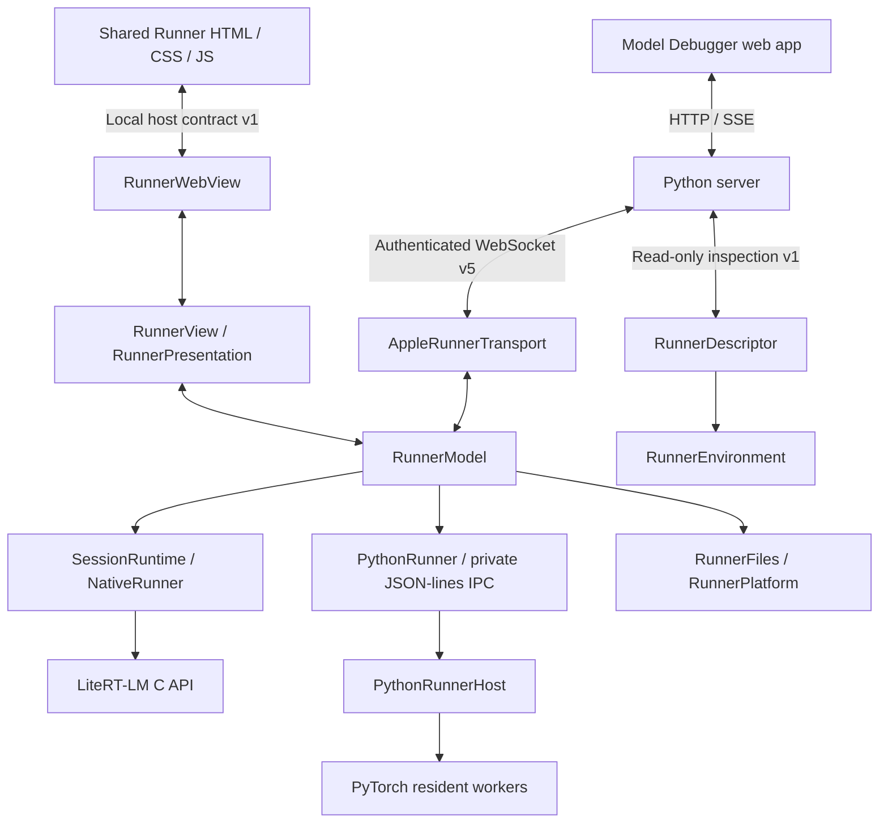

# Runner architecture

Each active Runner serves one execution side (`ref` or `target`) of one Model
Debugger Session. A physical Mac has at most two Runner slots, both assigned to
the same Session; iPhone has one. Each slot has its own App process, endpoint,
runtime and capture storage. Its bundled web UI displays local state and sends
local actions. Native code owns connections, files, Engine/Conversation handles,
KV cache and capture validation. The current native implementations target iOS
and Apple Silicon macOS. macOS can also own a configured local PyTorch
supervisor and its resident workers.



The two bridges serve different purposes. The UI bridge stays inside the App; it
is not a WebSocket and has no network requests. Server control uses the custom
Runner protocol, not the OpenAI API. On iOS, `iproxy` carries loopback WebSocket
traffic through USB. macOS uses local loopback or an explicitly selected
Thunderbolt bridge, or an authenticated SSH tunnel to a registered Mac. Device
access and Runner control are separate layers: a reachable device can have no
Runner, an occupied Runner, or an unknown Runner state. The main web app
continues to use HTTP/SSE with the server.

## One execution route

`JobManager` dispatches initialize/generate/close through `Runners`. The server
no longer owns model workers. Its subprocess path is limited to preparing LiteRT
capture models. `worker_command` rejects initialize/generate for either runtime.

`device: local` resolves to the one configured loopback Mac App. Existing
`Server host` values follow the same route; they never fall back to Python
execution in the server. Discovery presents one **This computer** entry and
retains `runnerId` to recognize previously saved explicit local Mac IDs. An
unstarted Runner can be launched from a verified, installed build selected by
the user. Unknown or unreachable Runner state fails explicitly; it is never
treated as proof that a Runner is absent. Existing saved configurations remain
readable, and both sides may select the same Mac. Device ownership is shared
across slots and compatible builds; slot ownership identifies the individual
execution side.

The App advertises `runtimes[]` in its descriptor and UI snapshot. LiteRT-LM
uses the native C API with CPU, context 1024 and existing capture limits.
PyTorch is advertised only when its local environment is configured and the App
listens on loopback. Its configured CPU/MPS/CUDA backend list is probed during
setup and validated again by the worker at execution. iPhone and remote Mac
PyTorch are not enabled by this implementation.

On macOS, `PythonRunner` launches the supervisor using a local configuration
file; network requests cannot choose its interpreter or package roots. The
supervisor owns one persistent worker per Session/role. Generate omits saved
history and uses the resident worker's messages and verified KV prefix.
Initialization starts an empty Chat; saved read-only Chats are never replayed
into a new Conversation. Exact-prefix validation and eager capture are
unchanged. An explicit Session close waits for worker exit before acknowledging.
Disconnect closes supervisor stdin so it cancels and reaps its workers. An
acknowledged execution error preserves the healthy control connection long
enough for the server to close the other role; an ambiguous/lost connection is
invalidated.

The PyTorch adapter currently uses local shared file paths for registered models
and result artifacts. It is restricted to the server Mac; SSH port forwarding
does not turn remote paths into local shared files. The two local Mac slots can
each host their own PyTorch model process. A local PyTorch Reference paired with
a remote LiteRT-LM Target can use the existing cross-runtime path. This is not a remote PyTorch model transfer protocol or a packaged Linux/Android Runner. See
[`src/runner/python/README.md`](../src/runner/python/README.md) and
[`src/runner/apple/README.md`](../src/runner/apple/README.md) for setup and
limits.

## Module responsibilities

<!-- mdformat off(preserve GFM table layout) -->
| Module | Responsibility |
| --- | --- |
| [`RunnerApp`](../src/runner/apple/Runner/RunnerApp.swift) | Composition, window and iOS background lifecycle |
| [`RunnerView`](../src/runner/apple/Runner/RunnerView.swift) | Native file dialogs and host action dispatch; rechecks allowed actions |
| [`RunnerWebView`](../src/runner/apple/Runner/RunnerWebView.swift) | Bundled WebKit page, main-frame message validation, serialized state delivery and renderer recovery |
| [`RunnerPresentation`](../src/runner/apple/Runner/RunnerPresentation.swift), [`RunnerUIState`](../src/runner/apple/Runner/RunnerUIState.swift) | Display projection and versioned state; no native runtime ownership |
| [`RunnerModel`](../src/runner/apple/Runner/RunnerModel.swift) | Published state, wiring and `allowedActions`; behaviour lives in [`RunnerModel+Lifecycle`](../src/runner/apple/Runner/RunnerModel+Lifecycle.swift) (activation, one Session/role owner, heartbeat expiry, cleanup), [`RunnerModel+Commands`](../src/runner/apple/Runner/RunnerModel+Commands.swift) (command dispatch, queued file commands), [`RunnerModel+ManualJobs`](../src/runner/apple/Runner/RunnerModel+ManualJobs.swift) (imported jobs, native execution, cancellation) |
| [`RunnerCommandCodec`](../src/runner/apple/Runner/RunnerCommandCodec.swift) | The wire field names, reply shapes and binary frame layout in one place; typed decoding of heartbeat, activation, model hash and execution requests. Tested against the shared fixtures in `src/contracts/fixtures/wire` |
| [`PythonExecutionAdapter`](../src/runner/apple/Runner/PythonExecutionAdapter.swift) | macOS PyTorch requests forwarded to the local Python Runner: the request in flight and Chat bookkeeping |
| [`HostBundle`](../src/runner/apple/Core/HostBundle.swift) | Bundle-derived facts (runtime-build provenance, app version, frameworks directory) that the App installs at launch; `Core/` never reads `Bundle.main` |
| [`jobs.py`](../src/server/package/model_explorer_debugger/jobs.py) | Session-scoped scheduling, paired preflight/generation, candidate Chat initialization and independent text/Debug publication |
| [`runner_channel.py`](../src/server/package/model_explorer_debugger/runtime/runner_channel.py) | One socket reader, request inbox, ownership-checked heartbeat acknowledgements and local action events. `call()` (one request, one reply) and `request()` (one operation, its event stream, cancellation and deadline) are the only places a request ID is matched |
| [`runner_device.py`](../src/server/package/model_explorer_debugger/runtime/runner_device.py), [`turn_outcome.py`](../src/server/package/model_explorer_debugger/runtime/turn_outcome.py) | One native operation as stages (job, terminal event, verified text, dump, Conversation record). Text, Debug data and link state are written only through `turn_outcome`; `RunnerRefused` marks a failure the Runner acknowledged on a healthy link |
| [`device_access.py`](../src/server/package/model_explorer_debugger/runtime/device_access.py), [`runner_builds.py`](../src/server/package/model_explorer_debugger/runtime/runner_builds.py) | Device registration, SSH/ADB access, installed build verification and bounded launch |
| [`RunnerSession`](../src/runner/apple/Runner/RunnerSession.swift) | Typed Session/role identity, runtime ownership and last successful summary |
| [`RunnerTransport`](../src/runner/apple/Runner/RunnerTransport.swift), [`AppleRunnerTransport`](../src/runner/apple/Runner/AppleRunnerTransport.swift) | Transport interface and Network.framework implementation; authenticated connection identity |
| [`SessionRuntime`](../src/runner/apple/Core/SessionRuntime.swift), [`NativeRunner`](../src/runner/apple/Core/NativeRunner.swift) | Runtime interface and direct C API adapter; capture validation and native pointer lifetime |
| [`PythonRunner`](../src/runner/apple/Runner/PythonRunner.swift) | macOS App-owned Python supervisor, private IPC and shutdown |
| [`python_runner_host.py`](../src/runner/python/package/model_debugger_runner/python_runner_host.py), [`python_workers.py`](../src/runner/python/package/model_debugger_runner/python_workers.py) | Independent Python supervisor and resident process ownership |
| [`pytorch_session.py`](../src/runner/python/package/model_debugger_runner/pytorch_session.py) | Resident model, Conversation/KV and eager capture implementation |
| [`model_debugger_contracts`](../src/contracts/python/package/model_debugger_contracts/__init__.py) | Shared input-rejection and model-identity contracts; no HTTP or model worker ownership |
| [`RunnerFiles`](../src/runner/apple/Runner/RunnerFiles.swift) | Serial file actor for macOS uploads, capture enumeration, hashing and downloads |
| [`RunnerDescriptor`](../src/runner/apple/Runner/RunnerDescriptor.swift), [`RunnerEnvironment`](../src/runner/apple/Core/RunnerEnvironment.swift) | Read-only capabilities/state projection and native device/turn measurements |
| [`RunnerPlatform`](../src/runner/apple/Runner/RunnerPlatform.swift) | Storage, connection credentials, interface selection and power assertions |
| [`src/runner/ui`](../src/runner/ui/README.md) | Shared production renderer and portable host contract |
<!-- mdformat on -->

`src/runner/` owns the platform App in `apple/`, bundled renderer in `ui/`, and
independent `model_debugger_runner` execution package in `python/`.
`src/contracts/python/` owns the shared `model_debugger_contracts` package, and
`src/capture/pytorch/` owns the `ai_edge_debugger_pytorch` hook package. The
Server retains routing, device access, job coordination and capture analysis;
Python execution imports use `model_debugger_runner`, while shared errors and
model identity use `model_debugger_contracts`. A CLI launch bridge remains at
`model_explorer_debugger.runtime.python_runner_host` for Apps registered with
that module name; it starts the independent Runner supervisor and does not
restore Server-owned execution. The App reads version-2 configurations written
by `src/runner/python/tools/configure_python.py`. Android/Linux can reuse
`src/runner/ui`, but still need native shells, runtime/transport adapters, file
handling and lifecycle integration.

## Ownership and scheduling

A saved Session record outlives an active execution. Server-side lifecycle
actions use `initialize` and `close`. Initialization reserves both sides and
initializes their Runners and first Conversations before the execution becomes
active. Initialization has no user cancellation. A failed initialization records
its stage and side and releases the resources acquired by that attempt.
Configuring a draft does not reserve a device. Operations are serialized within
each Session; different Sessions can run concurrently, as can Ref and Target
within a pair.

The server stores a stable identity in workspace `server-identity.json`. The
`activate` request carries `serverId`, `serverName`, `sessionId`, `sessionName`
and `runId`; optional `buildId` must match the running build. `activated`
confirms the same owner. Initialization and generation require this
authenticated control connection and exactly its Session/role. A different
Server, Session, or side cannot take over. Read-only inspection does not acquire
ownership. The model file cache remains separate from loaded Engine/Conversation
and KV state.

Each started parent Session has an in-memory execution instance with lifecycle
phase, active Chat identity, and per-side device, build, owner, connection and
execution status. `GET /api/sessions` includes this `execution` projection and
the current server identity; `GET /api/sessions/<id>/execution` exposes the same
state. Public owner details include `isCurrentServer`, derived by comparing
stable Server IDs; this display field is not added to activation messages. Chat
child records project their parent's execution. Merely switching Chat or
Chat/Debug mode does not create, close, or transfer Runner ownership. New Chat
ends the previous writable Chat when creation is accepted. Both fresh
Conversations must initialize before the candidate is published. Failure leaves
the previous Chat read-only and retains the creation error; the failed candidate
is excluded from the Chat list. Captures and outputs belong to the Chat record.

**Stop generation** cancels the current operation, waits for its terminal reply,
then sends `reset` to both owned Runners. Reset destroys the Conversation and
its memory KV while retaining the Engine/model and worker process. The Chat is
then read-only; New Chat creates empty Conversations on those same models. An
unsuccessful round is not published. If both successful outputs were confirmed
before Stop, that round is retained and Stop prevents the next round. Execution
errors prohibit New Chat for that Session. Model configuration changes require a
new Session; Chat configuration changes require a new Chat.

Before generation, both sides must complete `preflight`. It uses actual
tokenizer and message-template results, without consuming KV or sampling state.
Native LiteRT renders on a cloned Conversation; PyTorch serializes its current
history and reserves the requested output budget within its capacity check.
Capacity rejection leaves the current Chat writable and does not start either
generation.

Turning the **Model Server** switch off (the `close` request) is accepted after
initialization, including during generation. The server first cancels and waits
for the task, then sends `close`. Native cleanup stops runtime and file work,
releases the Python supervisor/native resources, and acknowledges `closed` only
after release. User requests cannot cancel initialization; server shutdown and
failed-start cleanup remain internal teardown paths. The server exposes `ending`
until cleanup is complete. End affects both sides and preserves saved
configuration, imported model files, and committed captures. macOS then
terminates the Runner App; iOS releases the owner and runtime resources but
retains an inactive App shell for read-only inspection and the next activation
of the same installed build. Its ended descriptor has no owner, busy work,
resident Sessions or control connection. The device becomes available after
cleanup and control disconnect complete; iOS does not programmatically
force-quit its App process. A Runner started with `--runner-session` expires
after 30 seconds if no Server activates it.

### Heartbeat and interruption

After activation the Server sends an application heartbeat every 5 seconds. The
Runner immediately returns `heartbeat_ack` with matching Server/Session identity
and sequence. The Runner ends if it has received no valid heartbeat for 30
seconds; the Server marks the execution interrupted if it has received no valid
acknowledgement for 30 seconds. Waiting for user input does not pause
heartbeats. An explicit socket close/error is detected immediately, including
for idle Sessions. Inference and file work do not own the heartbeat reader.

`RunnerChannel` has one socket receiver. It consumes heartbeat acknowledgements
and local `stop_requested`/`session_end_requested` events separately from the
serialized operation reply stream. The Server coordinates either local action
across both sides. Execution instance IDs fence late connection events so a
previous Start cannot interrupt a newly started execution of the same saved
Session. Native callbacks also fence operation and authenticated connection IDs.

On one Runner's unexpected disconnection, the Session becomes unavailable and
all Chats become read-only. The open Session remains readable, but cannot create
Chats or reconnect the lost execution. Already confirmed successful text and
complete server-side dumps remain valid. Remote deletion is not tracked after
loss, and no restart or later cleanup attempt is scheduled. Generate never
silently retries a possibly completed prompt. If task cancellation does not
finish within its wait budget, the Server fences/closes the connection instead
of starting a second consumer for in-flight replies. Native model loading
remains non-interruptible; cancellation is checked after loading returns.

The UI never owns runtime handles or heartbeats. WebKit state delivery is
coalesced and acknowledged; a failed delivery or terminated renderer gets one
reload attempt, followed by a static recovery message if it fails again.
Reloading the renderer sends the current snapshot without changing execution
ownership. Closing the browser does not end the Server's active Sessions.

## Capture identity

`CaptureJob.modelSHA256` identifies the entire `.litertlm` container.
`manifest.tapped_sha256` identifies its prepared TFLite section. These hashes
are different by design. The server verifies signature/op/output/tensor
coordinates against the actual model before sending a job; the standalone export
tool also checks the section hash. The Runner checks the full model hash on
initialization and checks capture shape, dtype, metadata and payload sizes.
Import validates the returned capture before attaching it to the Session.

The Runner does not independently parse the FlatBuffer to verify every declared
operator coordinate. Manually authored jobs must follow the preparation/import
workflow. A direct comparison of section hash and container hash is invalid.

## Candidate discovery and inspection

`GET /api/devices` enumerates the server host, wired iPhones, registered Macs,
registered SSH/ADB devices, and discoverable ADB candidates. A configured
address or connected USB device is not evidence that a Runner is running.
Discovery and read-only inspection do not launch Apps or acquire a control
connection.

`POST /api/devices/inspect` negotiates `model-debugger-inspect-v1` on the
existing authenticated endpoint. The version-1 descriptor has additive
protocol/build, lifecycle and owner fields, together with existing App-instance
identity, capabilities, environment and sampled measurements. Inspection cannot
submit commands, occupy the control slot or trigger teardown. Unsupported peers
never fall back to a control connection. Pending/observer peers are bounded and
expire after five seconds. `checkedAt` identifies an observation, not a
continuous availability guarantee.

Device reachability and Runner state are projected independently. An active
Runner makes the device unavailable to another Session, even if it belongs to
the current Server and is currently waiting for input. Its owner identifies the
Server, Session and role. A failed check yields unknown/unreachable state, never
an assumed empty device. Start checks again before activation; the native owner
check is the final authority when Servers race.

An already paired iPhone can be inspected through a temporary USB tunnel without
restarting or reconfiguring its App. Existing pairing tokens are reused. A
device whose Runner status or pairing cannot be established is not silently
reprovisioned. USB launch no longer uses `--terminate-existing`. Mac inspection
uses loopback, the selected Thunderbolt interface, or a registered SSH tunnel.
Tokens and SSH connection configuration do not appear in descriptors or public
UI state.

### Installed builds and remote device access

`GET /api/devices/builds?id=<deviceId>` returns only explicitly registered build
candidates, with verified availability and a reason when they cannot launch. The
workspace `runner-builds.json` identifies installed Apps and the devices on
which they are installed; it is not a download service. A Session run stores the
chosen opaque ID in `runnerBuild`. For an already running Runner, the actual
build is used and checked; switching a running build is rejected. If no Runner
is running, Start requires a selected, verified build and positive evidence of
absence before launching. Two compatible builds may use the same Mac's separate
slots; installing or launching Target does not replace Reference's App or
runtime libraries.

Local macOS Apps and registered SSH macOS Apps can be launched. USB iOS launch
uses the existing Runner app container and requires verified installed identity.
When platform tools cannot expose the installed CL/build identity, the catalog
explains the limitation instead of advertising a launchable build. Android/ADB
devices can be discovered and inspected through the access layer, but no Android
native execution adapter is implemented. SSH likewise does not enable the local
shared-file PyTorch adapter on remote machines.

## Environment snapshots

`RunnerEnvironment` obtains device facts through native APIs. A static device
snapshot contains model identifier, architecture, OS, physical RAM, logical CPU
count and available App/runtime build identity. macOS also reports the native
chip string; iOS does not guess its chip from a lookup table.

Every successful LiteRT-LM native initialize/generate result includes
`environment.version: 1`:

-   `device` and `capabilities`: immutable device/build facts and actual runtime
    support.
-   `session`: effective model container hash, CPU backend, context length,
    capture-point count, sampler and runtime-default thread policy.
-   `maxOutputTokens`: this request's effective output limit.
-   `before` and `after`: timestamped thermal state, low-power mode and process
    resident memory around the native request.

Physical iOS additionally reports process memory headroom when available. This
is not system-wide free RAM; macOS and simulator omit it. Missing measurements
remain absent. Records describe the Runner, not the server. PyTorch preserves
its worker versions, effective settings, eager-capture environment and telemetry
in its existing result format. Settings measurements describe the App process,
not aggregate memory of its Python children. Failed requests currently have no
successful result snapshot; there is no continuous memory/thermal sampler.

Settings → Environment renders the native facts and supports **Refresh
readings**. This updates UI measurements only and does not touch
Engine/Conversation handles. The shared UI contract remains version 1 with
additive optional environment fields.

## File work

Every side returns its complete successful output and terminal status before
transferring that side's per-turn dump. `run_files` seals an immutable file
inventory with a `manifestId`. The server receives into staging, checks every
declared size/hash, flushes files and commits the directory, then sends
`run_received` for that exact run and manifest. The connected Runner deletes
only that export. A later receipt failure cannot invalidate data already
received.

Stopped/failed artifacts are sealed after callbacks and writers finish and can
be received as raw data; they are never imported as successful Debug Turns.
Successful text is stored separately in `successful_turns`. If both generations
succeeded but a dump or its Debug validation fails, that Turn retains the full
text with `debug_data.status=unavailable`. Later captured Turns keep their
actual Turn numbers even when an earlier Turn has no Debug data.

`RunnerFiles` is a serial actor. File enumeration, chunk I/O and SHA-256
computation run outside the main actor, with cancellation checks during
enumeration and hashing. Only serialized data and typed progress cross the actor
boundary. The coordinator fences replies by request epoch and authenticated
connection identity. Disconnect cancels pending work and waits for transfer
cleanup before accepting another file operation. Offset checks, final hash
validation and atomic upload commit remain in place. This removes main-actor
file work; it is not a measured throughput claim.

### Protocol v5: the file plane

v5 changes no v4 message; it adds three things, and the Server still drives a v4
Runner the old way (`SUPPORTED_PROTOCOL_VERSIONS` in `runtime/protocol.py`). The
wire contract is `runner-wire.schema.json` in `src/contracts`, with one fixture
per message under `fixtures/wire`. The Server suite drives its real code paths
against a schema-checked in-memory Runner (`test/test_runner_wire.py`); the
Runner suite decodes the same Server fixtures and compares the members of its
replies with the Runner ones.

1.  **File links.** A Mac Runner listening on loopback says `fileLink: true` in
    `hello`. The Server, unless it reached it through an SSH tunnel, sends
    `model_link {modelSHA256, path}` instead of the bytes: the Runner copies the
    file (an APFS clone on a shared volume), hashes it and commits it only under
    the hash asked for. A refused link falls back to an upload. In the other
    direction `run_files {link: true}` is answered with the export's `root`; the
    Server clones each sealed file into staging and still checks every size and
    SHA-256, commits the directory and sends `run_received`. The Runner refuses
    both away from loopback.
2.  **Binary frames.** `upload_chunk` and the `file_chunk` reply carry their
    bytes after a JSON header (4-byte big-endian header length, header, raw
    bytes) rather than as base64 inside JSON. A `file_chunk` request asks for it
    with `encoding: binary`.
3.  **A send window.** File commands queue on the Runner (at most 16, in arrival
    order, one reply each), so the Server keeps 8 chunks in flight (`pipeline()`
    in `runner_channel.py`). Offsets are still checked per chunk; an abandoned
    transfer drains its outstanding replies so the next request never reads
    them.

A generate job also carries `expect {runtimeInstance, turnSequence,
tokenCount}`, the state the previous result left. The Runner refuses the message
before it touches the KV cache when its Conversation differs; the Server still
verifies the result afterwards.

Measured on one Mac with a tapped Gemma 4 E2B model (2.59 GB), CPU and GPU slots
initialized in parallel:

<!-- mdformat off(preserve GFM table layout) -->
| | v4 | v5 binary + window | v5 link |
| --- | --- | --- | --- |
| Model to one slot | ≈120 s, ≈5,000 round trips, ≈21 MB/s | 11 s, ≈230 MB/s | 4 s (hashing), no bytes sent |
| `initialize` job, both slots, including launching both Apps | ≈2 min | 20.6 s | ≈16 s |
| Extra disk per slot | 2.59 GB | 2.59 GB | none (clone) |
| Turn dump (27–53 MB per side) | ≈300 `file_chunk` round trips | pipelined binary chunks | no `file_chunk` at all |
<!-- mdformat on -->

iPhone models still travel by `devicectl copy`; iPhone dumps use binary frames
and the window once its App is rebuilt. PyTorch keeps its own request shape and
local shared paths; bringing it onto the same job/dump pipeline is not done.

## Validation

Run deterministic coordinator regressions with `bash
src/runner/apple/Tools/check_runner.sh`. The production transport/runtime
interfaces have real adapters and controlled test adapters; the tests drive
commands and observe outward behavior.

The server test suite covers owner activation, request/heartbeat separation,
stale connection events, idle disconnect, device exclusion, parent/child Chat
ownership, Stop without model reload and End while busy. Run the server suite
with:

```sh
SERVER_PYTHON=src/server/.venv/bin/python bash ci/test_server.sh
```

`Core/` and `Runner/` currently compile as one module; making `Core/` its own
target (public API surface, separate scheme) remains open.
