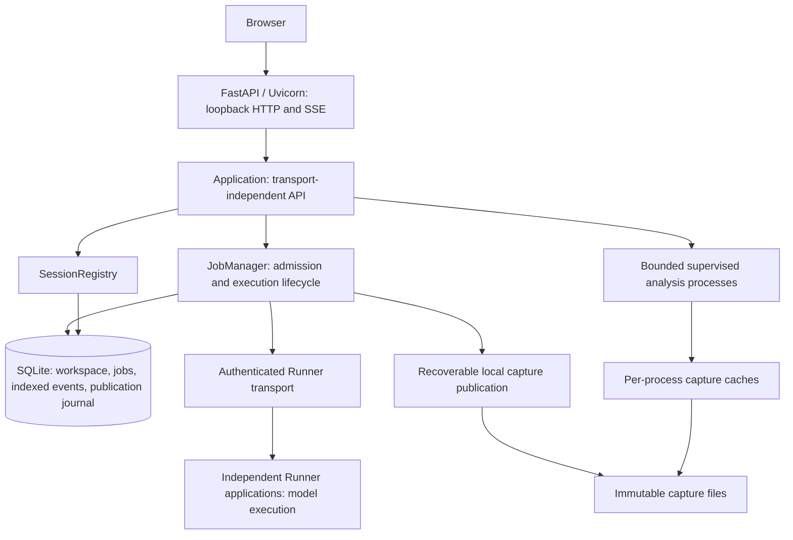

# Server architecture and recovery

The Server runs FastAPI/Uvicorn over a SQLite-backed workspace coordinator and
supervised analysis worker pool.



## 1. Admission and lifecycle

Admission validates identity, configuration and ownership before releasing a
gated worker. Reservation, initial job/event and accepted workspace state form
one SQLite transaction. Failed admission restores in-memory execution/device
ownership and removes new staging files. A uniqueness constraint on
`(session_id, request_id)` preserves idempotency. A retry with changed input
remains an error.

The Server coordinates Runners; analysis processes never execute models. Restart
invalidates loaded execution state. A recovered server does not reconnect a
Runner or rerun a prompt automatically.

## 2. Durable metadata and capture recovery

`workspace.sqlite3` is authoritative. SQLite uses WAL, foreign keys and
`synchronous=FULL`. Each thread keeps one writer and one reader connection;
writers serialize on the database lock with `BEGIN IMMEDIATE`, reads use WAL
snapshots without that lock. Streaming `delta`/`progress` events are journaled
in memory and committed in batches by `event_journal.py`; any status or result
row, an SSE page and shutdown flush the journal first, so durable event order is
never violated. Cancellation is a `threading.Event` per job; the `cancel`
sentinel file remains only for the preparation subprocess. Sessions, their saved
Turns and registered artifacts are rows (schema version 2; a version-1
single-JSON workspace is split into rows on first open), and a save upserts only
the rows that changed. Workspace admission, ordered job events, and publication
metadata have transactional boundaries; nested operations use savepoints.
Delta/progress events append without serializing the entire growing output.
Startup reconstructs the latest output from the last job snapshot and following
events.

On the first start, legacy `workspace.json`, job snapshots and JSONL events are
imported atomically. Originals are copied to `.legacy-metadata/`; an incomplete
final JSONL append is ignored, while corrupt interior events reject migration.
`workspace.json` remains a tooling export, written at startup, at shutdown and
on request (`SessionRegistry.export_workspace()`), not on every change; startup
always loads SQLite and regenerates the export. Job JSON files are no longer
current status APIs.

Confirmed generation text and a local publication journal commit before debug
import. Capture files are validated and flushed, then the directory is renamed
and its parent flushed. A second transaction commits the capture pointer and
publication event. On restart, pending publication adopts an already validated
capture or rebuilds from received local artifacts. Missing or invalid evidence
resolves to `debug_data.status=unavailable`; successful text is preserved.
Recovery never sends a model execution command.

### Upgrade and backup

1.  Stop the old server; it does not understand the new coordinator lease.
2.  Start the normal CLI against the same workspace. Migration is automatic.
3.  Check `/api/diagnostics`, saved Sessions and captures.

Only one new CLI coordinator may own a workspace (`.server.lock`, OS file lock).
Use a local filesystem. For backups, stop the coordinator and copy the whole
workspace, including SQLite and captures; do not copy only `workspace.json`.
Downgrading to an old binary after new writes is unsupported.
`.legacy-metadata/` is migration evidence, not a current backup.

## 3. Analysis isolation and event delivery

Defaults: two spawned analysis processes, eight waiting requests, a 60-second
request deadline including worker queue time, and 8192 MiB per process.
Concurrent identical queries share in-flight computation. Each worker reuses up
to four capture readers within a 32 MiB JSON metadata budget; existing numerical
caches keep their own bounds. File identity, size and timestamps invalidate
caches. A capture changing during analysis rejects the result.

The parent checks RSS while work runs and terminates a worker exceeding its
budget. Linux also applies an address-space limit; macOS uses RSS supervision
because its address-space limit is unavailable here. RSS supervision is sampled,
so brief overshoot is possible. Timeout, cancellation or process death retires
the affected process; the next request starts a replacement. Numerical responses
are capped at 32 MiB. HTTP 503 and `Retry-After: 1` expose
overload/interruption; clients decide whether to retry.

SSE reads indexed pages of 256 events after `Last-Event-ID` (or `after`).
Connections rotate after 25 seconds. A terminal job drains every remaining page
before closing. Disconnecting SSE does not cancel generation. Disconnecting an
analysis request cancels its analysis work.

## 4. HTTP and operational boundaries

The default CLI runs FastAPI/Uvicorn with one coordinator, a concurrency limit
of 128, five-second keep-alive and a 45-second graceful HTTP shutdown window.
Business dispatch lives in `api.py`. Tests drive the same `Application` through
`fastapi.testclient` (`test/inline_asgi.py`, analysis evaluated in-process);
there is no second HTTP transport. Use the CLI for normal service operation.

The HTTP boundary validates loopback Host and write Origin, caps ordinary JSON
at 64 KiB and Turn JSON at 32 MiB, and streams uploads through a bounded queue
to the existing durable writer. Uploads are limited to 20 GiB and 60 seconds;
interrupted uploads remove partial files. Static files must resolve inside the
configured UI root.

`/api/health` reports HTTP availability. `/api/diagnostics` reports coordinator
storage, active jobs and analysis process counts/restarts/limits. These do not
prove Runner availability or accelerator residency. Requests receive generated
`X-Request-ID` values; structured logs record method, path, status and elapsed
time without request bodies or model output.

```sh
src/server/.venv/bin/python -m model_explorer_debugger.server \
  --workspace /absolute/path/to/workspace --ui /absolute/path/to/ui --port 8080 \
  --analysis-workers 2 --analysis-waiting 8 --analysis-timeout 60 \
  --analysis-memory-mib 8192
```

## Verification

Run the backend test suite with `SERVER_PYTHON=src/server/.venv/bin/python bash
ci/test_server.sh`. The suite covers admission faults, SQLite rollback after
abrupt process exit, legacy workspace migration, publication recovery, analysis
worker crash/timeout/cancellation/memory/overload handling, query coalescing,
cache invalidation, numerical parity, SSE tail paging, partial uploads,
exclusive coordinator ownership, real socket CLI startup and graceful shutdown.
