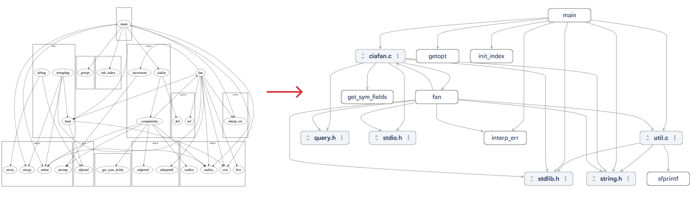

This is an example adapter extension that adds basic support for
[GraphViz DOT](https://graphviz.org/pdf/dotguide.pdf) format to Model Explorer.
It uses [pydot](https://pypi.org/project/pydot/) to parse the input `.dot` file
and converts it into Model Explorer graphs. It only supports a subset of
features in DOT, including node labels, edge connections, and
subgraphs/clusters.

Check out the
[Develop Adapter Extension](https://github.com/google-ai-edge/model-explorer/wiki/6.-Develop-Adapter-Extension)
wiki to learn more.



<br>

# Run it locally

Run the following commands under the top `graphviz_dot_adapter` directory:

```shell
# Setup python venv.
$ python3 -m venv venv
$ source venv/bin/activate

# Run Model Explorer with the "graphviz_dot_adapter" extension.
#
# Note the "." at the end.
$ pip install -e .
$ model-explorer example.dot --extension=graphviz_dot_adapter
```
