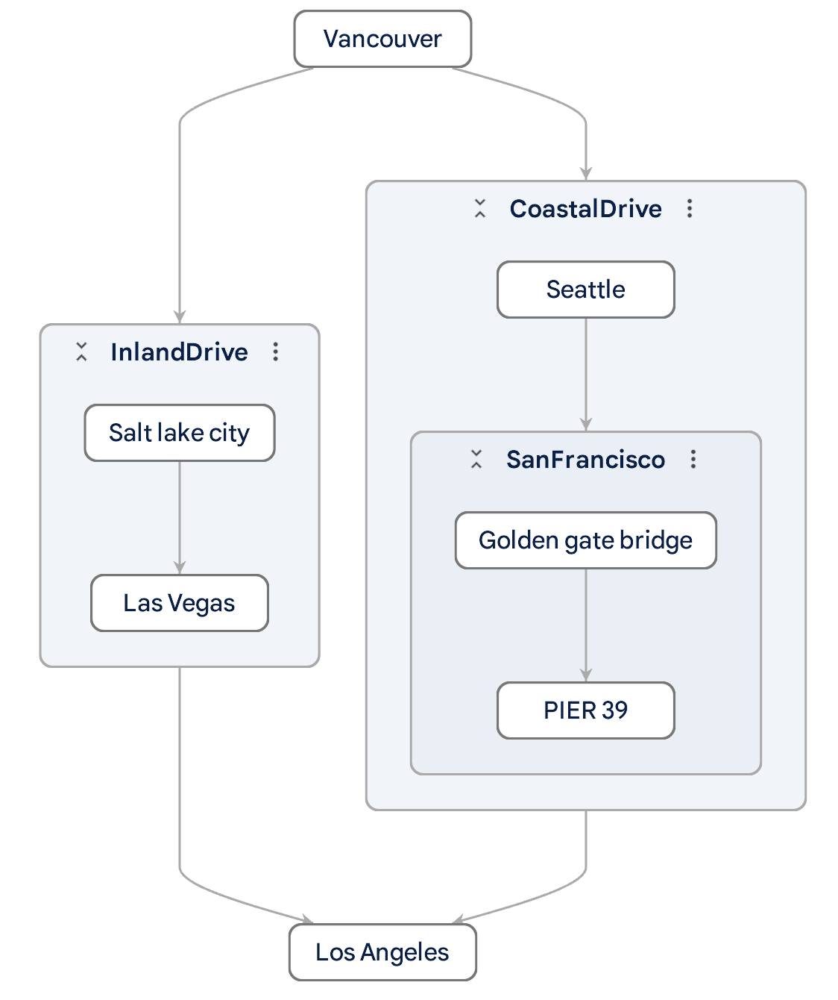

This is an example adapter extension used in the
[Develop Adapter Extension](https://github.com/google-ai-edge/model-explorer/wiki/6.-Develop-Adapter-Extension)
wiki.

This adapter adds support for a imaginary `.test` model format and always
returns the same graph:



<br>

# Run it locally

Run the following commands under the top `my_adapter` directory:

```shell
# Setup python venv.
$ python3 -m venv venv
$ source venv/bin/activate

# Run Model Explorer with the "my_adapter" extension.
#
# Note the "." at the end.
$ pip install -e .
$ model-explorer model.test --extension=my_adapter
```
